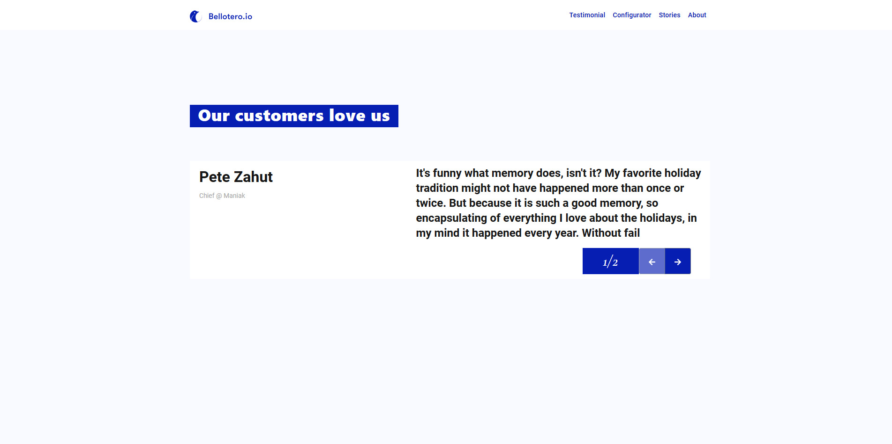
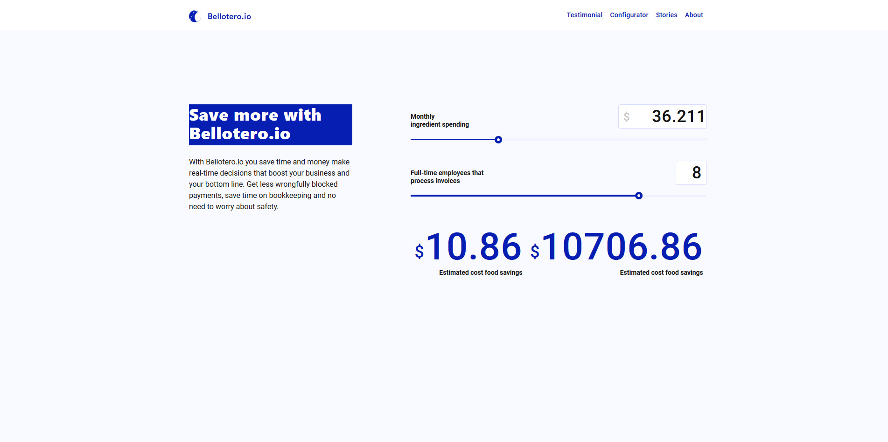

## Description
`Bellotero.io is the digital solution that 􀀀gives you fast, accurate, automated accounts
payable and smart, 􀀀business-transforming insights.`

**Belloterio.io requires the following:**

    ● Create a web page based on the provided design ( https://zpl.io/25NEEAW ).
        ○ Build it in ReactJs/Redux
    ● Data should not be hardcoded, everything should be pulled.
    ● Don’t pull information that is not on the page.
        ○ For example, if open the site on page 1 it should have only the page information in the state, 
            and pull page 2 information until you navigate to that page
        ○ You should use redux thunk , redux sagas or any other async redux library.
    ● We recommend to use axios or fetch to pull data.
    ● For app global components, pull data from app.json

**Page 1:**

    ● Pull additional data from page1.json
**Page 2**

    ● Create a functional calculator
        ○ Monthly ingredient spending use a range between 10-100
        ○ Full-Time Employees… use a range between 1-10
        ○ Estimated Food Cost Saving = Monthly ingredient spending * 0.3
        ○ Your estimated annual savings = Full-Time Employees * 1337 + Estimated Food Cost Saving
    ● Note : Values on design are not accurate, ignore them.
    ● Pull data from page2.json
**Notes**

    ● Use any tool/library you require (webpack, gulp, bootstrap, etc)
    ● Use a CSS preprocessor (SASS, LESS) (optional)
    ● Deliver the page in a public repository (i.e. github) with the information needed to run it
    ● Don’t forget to enable redux dev tools in your code

## Available Scripts
In the project directory, you can run:

### `npm install`

after

### `npm start`

Runs the app in the development mode. 
Open [http://localhost:3000](http://localhost:3000) to view it in the browser.

The page will reload if you make edits. 
You will also see any lint errors in the console.

### `npm test`

Launches the test runner in the interactive watch mode. 
See the section about [running tests](https://facebook.github.io/create-react-app/docs/running-tests) for more information.

### `npm run build`

Builds the app for production to the `build` folder. 
It correctly bundles React in production mode and optimizes the build for the best performance.

The build is minified and the filenames include the hashes. 
Your app is ready to be deployed!

See the section about [deployment](https://facebook.github.io/create-react-app/docs/deployment) for more information.

### `npm run eject`

**Note: this is a one-way operation. Once you `eject`, you can’t go back!**

If you aren’t satisfied with the build tool and configuration choices, you can `eject` at any time. This command will remove the single build dependency from your project.

Instead, it will copy all the configuration files and the transitive dependencies (Webpack, Babel, ESLint, etc) right into your project so you have full control over them. All of the commands except `eject` will still work, but they will point to the copied scripts so you can tweak them. At this point you’re on your own.

You don’t have to ever use `eject`. The curated feature set is suitable for small and middle deployments, and you shouldn’t feel obligated to use this feature. However we understand that this tool wouldn’t be useful if you couldn’t customize it when you are ready for it.

##ScreenShots

**Page Testimonial**
<a href="screenshoots/page-testimonial.jpg">View</a>

**Page Configurator**
<a href="screenshoots/page-configurator.jpg">View</a>

## Learn More

You can learn more in the [Create React App documentation](https://facebook.github.io/create-react-app/docs/getting-started).

To learn React, check out the [React documentation](https://reactjs.org/).

### Code Splitting

This section has moved here: https://facebook.github.io/create-react-app/docs/code-splitting

### Analyzing the Bundle Size

This section has moved here: https://facebook.github.io/create-react-app/docs/analyzing-the-bundle-size

### Making a Progressive Web App

This section has moved here: https://facebook.github.io/create-react-app/docs/making-a-progressive-web-app

### Advanced Configuration

This section has moved here: https://facebook.github.io/create-react-app/docs/advanced-configuration

### Deployment

This section has moved here: https://facebook.github.io/create-react-app/docs/deployment

### `npm run build` fails to minify

This section has moved here: https://facebook.github.io/create-react-app/docs/troubleshooting#npm-run-build-fails-to-minify
